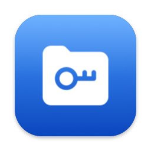

<p align="center">
  
</p>

# GocryptKit

Native, driverless, high-security [gocryptfs](https://github.com/rfjakob/gocryptfs) encrypted vault manager for macOS, powered by Apple's modern **FSKit** framework.

**Zero kexts. Zero macFUSE. Zero sudo. Zero security compromises.**  
SIP (System Integrity Protection) remains fully enabled — no Reduced Security required, no FUSE-T needed.

[中文文档 (README in Chinese)](README-zh.md)

---

## Highlights & Features

- **Apple Native Integration**: Built on macOS FSKit (User-space File System framework). Mounts appear directly in Finder, Terminal, and standard file dialogs.
- **Hardened Credential Security**: 
  - TLV-tagged Keychain protocol (consume-on-mount / burn-after-reading).
  - Explicit in-memory scrubbing (`memset_s`) for MasterKeys, passwords, and scrypt buffers to prevent secrets from landing on swap or core dumps.
  - CLI never exposes passwords in process tables (`ps`) or shell history (interactive no-echo input or `--password-stdin` pipeline).
- **Physical Handle Concurrency Isolation**: Read and write file descriptors are physically decoupled with granular reader-writer locks, eliminating kernel `EBADF` race conditions.
- **Native Extended Attributes (xattr)**: Full macOS xattr support encrypted via EME + DirIV (AES-GCM), preventing `._*` AppleDouble file pollution.
- **MenuBar & App Experience**:
  - Live status item with dynamic lock state icons (`lock.open.fill` when mounted).
  - Unmount debounce & mutual exclusion locks.
  - Aggregated conflict dialog when multiple volumes encounter `EBUSY`.
- **Modern SwiftUI Client**: Effortlessly create new encrypted vaults or mount existing directories. Real-time kernel mount table synchronization (`getfsstat`).

---

## Download & Releases

**v1.3.8** — Robustness, UI Pre-flight & Event-driven Sync Release (macOS Apple Silicon)

→ [Download on GitHub Releases](https://github.com/maxing-labs/GocryptKit/releases/tag/v1.3.8)

| Property | Value |
|---|---|
| Package | `GocryptKit-1.3.8.dmg` |
| Architecture | Apple Silicon (`arm64-only`) |
| Code Signing | Developer ID Application (Apple Notarized & Stapled) |

Verify the release DMG:

```bash
shasum -a 256 GocryptKit-1.3.8.dmg
spctl -a -t open --context context:primary-signature -vv GocryptKit-1.3.8.dmg
```

See [Getting Started](#getting-started) below for setup instructions.

---

## What's New

### v1.3.8 (2026-09-19) — Robustness & Architecture Enhancements
- **Mount Point Pre-flight Hint**: Added real-time non-intrusive warning in the vault card when a target mount directory already exists and is not empty or is a file.
- **Card Layout & Writable Toggle**: Added localized "Writable" label adjacent to the mount mode switch toggle, and placed "Mount Point" above "Encrypted Directory" for a more natural top-down workflow.
- **Typed Error Architecture**: Introduced `MountError` and `UnmountError` enums in `VaultCore` for structured, type-safe error handling and localization across the app and CLI.
- **Dual Mount State Sync**: Integrated `NSWorkspace` notifications (`didMountNotification`, `didUnmountNotification`) for instant sub-second UI updates when volumes are mounted or ejected via Finder, backed by periodic polling.
- **CLI Forced Unmount**: Added `-f` / `--force` flags to `GocryptKit umount` CLI command.
- **Zero-Byte File Read Fix**: Fixed engine I/O behavior on empty files to return EOF cleanly instead of erroring out.
- **Comprehensive Test Suite**: Added `RobustnessTests` covering block boundaries (0B, 4096B, 4097B), multi-threaded concurrent read/write, bit-rot/tampering rejection, and typed error parsing (108/108 tests passing).

### v1.3.7 (2026-09-19) — Unmount Reliability & UI Polish
- **Unmount Experience & Reliability**:
  - **Busy Volume Handling**: Fixed silent unmount failures on in-use volumes. When a vault has open file handles (e.g. media players or Finder), clicking Unmount in the main window now immediately presents an alert offering "Force Unmount", ensuring 100% parity with the menu bar tray.
  - **Auto-expand on Error**: Automatically expands the vault card and displays humanized error diagnostics and inline force-unmount controls if unmounting is cancelled or blocked.
  - **Mount Path Fallback**: Hardened mount point path resolution with automatic fallbacks for read-only suffixes (`_READ_ONLY`) and live kernel mount table queries.
- **UI & Layout**:
  - **Mount Mode Switch Toggle**: Upgraded the temporary read-only mount checkbox to an intuitive macOS native Switch toggle. Switching ON selects read-write mode ("Mount in read-write mode"), while switching OFF activates read-only mode ("Mount in read-only mode") with orange status indicators and instant mount button / path preview synchronizations.
  - **Password Error Positioning**: Fixed error message placement for failed unlocks (wrong password / masterkey). The warning banner is now displayed directly beneath the password input and automatically clears when typing a new password.
  - Moved the low-frequency "Name" (vault rename) input field to the very bottom of the card details, keeping high-frequency mount controls prominent.

### v1.3.6 (2026-09-19) — UI Polish & Localization Fixes
- **UI & Interaction**:
  - Moved the password input field, Mount button, and Read-Only checkbox to the very top of the expanded vault card for immediate keyboard focus and visual priority.
  - Moved the low-frequency "Name" (vault rename) input field to the very bottom of the card details.
  - Removed card-level keyboard focus highlight: eliminated distracting blue focus border overlays on vault tiles, restoring clean native dividers.
- **Localization**:
  - Fixed Caps Lock indicator bubble showing `"localized string not found"` by providing a full language fallback chain (`["zh-Hans", "zh-CN", "zh", "en"]`) and declaring `CFBundleLocalizations`.
  - Added localized strings for static 4-character password length validation and Caps Lock indicator.
- **Build & Quality**:
  - Full notarized & stapled DMG release (`GocryptKit-1.3.6.dmg`), passing all unit tests and 108 end-to-end assertions.

### v1.3.5 (2026-09-19) — Quality, Concurrency & Security Hardening
- **Security Hardening**:
  - Added secondary confirmation warning dialog when creating a vault with a weak password (<8 characters or weak strength), preventing accidental weak passphrases while keeping policy flexible.
  - Extended `OrphanReaper` to perform deep sweeping of temporary read-only session credentials (`mountctx:`) on app startup and termination.
  - Eliminated redundant facades (`KeychainHelper` and `KeychainReader`) to standardize directly on `VaultCore.KeychainStore`.
- **Concurrency & Reliability**:
  - Implemented async stream draining for child process stderr in `ProcessRunner` using Swift 6 thread-safe `LockedBuffer`, completely eliminating OS pipe deadlocks on outputs exceeding 64 KiB.
  - Consolidated duplicate timeout process runner logic from `MountManager` into `ProcessRunner`.
  - Enforced strict `@MainActor` thread safety for `MountManager.extensionStatus` and added thread-safe helper inspection to eliminate race conditions between background polling and UI rendering.
- **UI/UX & Localization**:
  - Clarified read-only mount options between persistent default configuration and temporary session-only mounts.
  - Added automatic recursive directory creation when specifying non-existent paths during vault initialization.
  - Fully localized macOS system menus (Edit, Window, Undo/Redo, Cut/Copy/Paste, Select All) in both English and Simplified Chinese.
  - Added keyboard focus (`.focusable()`) and Space key toggle for vault cards.
- **Verification**: 104 unit test assertions and 108 end-to-end integration test assertions passing with Apple Developer ID notarization and stapling.

### v1.3.4 — Dynamic Localization & Read-Only Regression
- Fixed cold-start language switching inconsistency by synchronizing `AppleLanguages` with app preferences.
- Added comprehensive E2E test assertions verifying read-only volume CRUD kernel-level blocking.

### v1.3.0 – v1.3.3 — Read-Only Finder Integration & Build Automation
- Ensured consistent `_READ_ONLY` volume naming in Finder sidebar and window titles via shared `MountContextStore` keychain intent.
- Added robust comma-separated task options parsing (`ro`, `rdonly`, `volname`) in FSKit volume loader.
- Automated release pipeline optimizations with notary submission retries and `create-dmg` headless fallback.

### v1.2.5 — Defense-in-Depth & Unmount Safety
- Added defensive `umount -f` force-unmount fallback on app termination to prevent lingering mountpoints.
- Added direct GitHub repository and documentation links to the standard About panel.

### v1.2.4 — Official Open-Source Release
- First public open-source release on GitHub ([maxing-labs/GocryptKit](https://github.com/maxing-labs/GocryptKit)) under GPL-3.0 with Apple App Store Exception.
- MenuBar companion enhancements: unmount debounce, mutual exclusion locks, and aggregated conflict dialog when multiple volumes encounter `EBUSY`.
- Flexible password policy: replaced hard blocking on short passwords with advisory warning badges.
- Translated all codebase technical comments to English.

### v1.2.0 — Architecture Decoupling & Review
- Refactored core modules to address code review findings and strengthen separation of concerns.

### v1.1.2 — Media Seek Stabilization & App Interception
- Fixed `EIO` (Input/output error) on large video file random seek and Python `pread` via Chunked Read Loop in Go C-API.
- Decoupled read and write file handles with independent reference counting and granular locks.
- Added app termination interception with safety prompts when active mounts exist.
- Fixed focus-stealing bug on unmount.

### v1.1.0 — Hardened Credential Protocol & App Refactoring
- Standardized on TLV-tagged credential protocol (Magic: `VCP1`) with strict length checks and trailing garbage rejection.
- Decomposed monolithic app views into `ContentView`, `VaultRowView`, `VaultRowViewModel`, and `MountManager`.
- Expanded unit test suite to 90 tests.

### v1.0.1 — MenuBar Integration & Auto-Focus
- Introduced MenuBar status item with dynamic lock state icons (`lock.open.fill` / `lock.fill`).
- Added automatic focus on password field upon vault row expansion.
- Completed stress testing on large video and binary payloads.

### v1.0.0 — Project Rebranding & Initial Milestone
- Project officially renamed from `GocryptfsKit` to `GocryptKit`.
- Packaged official notarized macOS DMG distribution.
- Completed comprehensive security audits, architecture documentation (`AGENTS.md`), and clean export tooling.

### v0.2.3 — Deep Security Hardening
- Introduced TLV-tagged Keychain protocol to prevent type confusion between passwords and scrypt hashes.
- Enforced consume-on-mount credential lifecycle (`deleteCredential`).
- Implemented pure-logic `OrphanReaper` algorithm for cleaning up stale credentials.
- Explicit in-memory secret scrubbing via `memset_s`.
- Removed plaintext `--password` CLI argument in favor of masked terminal input and `--password-stdin`.
- Enforced POSIX `0600` permissions on registry files.

### v0.2.2 — Internationalization & UI Enhancements
- Added English and Simplified Chinese localization.
- Added password visibility toggle.
- Explored iOS/iPadOS client architecture prototype.

### v0.2.1 — Resilience & Extension State Fixes
- Decoupled release smoke-tests from live extension state.
- Resolved FSKit probing issues while volumes were mounted.

### v0.2.0 — Multi-Vault Management & App Branding
- Multi-vault list UI in SwiftUI.
- Dedicated App Icon design (folder-key glyph).
- Improved FSKit module status detection via `pluginkit`.

### v0.1.0 — Initial Public Milestone
- First distributable notarized DMG release.
- Native FSKit read-write gocryptfs volume, host app, and CLI (`init`, `mount`, `umount`, `status`).
- Developer ID release pipeline with inside-out code signing and initial 87-assertion E2E test suite.

### Pre-Release Milestones (M0 – M2.5)
- **M2.5**: Hardened credential channel between host and FSKit extension; interactive masked CLI input and `--password-stdin` pipeline; initial bilingual localization.
- **M2**: Full read-write filesystem mutations; native macOS extended attributes (`xattr`) encrypted via EME + DirIV (AES-GCM); `.fseventsd/no_log` suppression.
- **M1.5**: Reproducible Developer ID code signing pipeline; initial Apple Notarization (`notarytool`) and stapling automation; authoring of the end-to-end integration test suite over real media files (PDF, MP3, MP4, text).
- **M1**: Read-only FSKit volume implementation; successfully mounting and decrypting gocryptfs vaults into Finder without drivers or kernel extensions.
- **M0.5**: FSKit registration, lifecycle, and filesystem module (`FSFileSystem`) integration spike.
- **M0**: Core engine build (`libgocryptfs` darwin/arm64 c-archive packaged into `libgocryptfs.xcframework`), `VaultCore` Swift package foundation, and `vaultctl` test CLI.

---

## Getting Started

### Installation & First Launch

1. Drag `GocryptKit.app` to `/Applications`.
2. Launch `GocryptKit.app` once.
3. Enable the File System Extension:  
   **System Settings → General → Login Items & Extensions → Scroll to bottom → File System Extensions → Toggle GocryptKit ON**.
4. In the app, click **"Add Existing Vault…"** to select a cipher directory, or **"Create New Vault…"** to initialize an empty directory.
5. Enter your password and click **"Mount"**. The decrypted filesystem is instantly accessible in Finder!

### Command-Line Interface (CLI)

The application bundle contains a full-featured CLI interface:

```bash
# Initialize a new encrypted vault interactively (secure masked input)
/Applications/GocryptKit.app/Contents/MacOS/GocryptKit init <empty-dir>

# Scripted automated vault creation via stdin pipeline
echo "your-password" | /Applications/GocryptKit.app/Contents/MacOS/GocryptKit init <empty-dir> --password-stdin

# Mount an encrypted vault
/Applications/GocryptKit.app/Contents/MacOS/GocryptKit mount <cipher-dir> <mountpoint>

# Unmount a vault
/Applications/GocryptKit.app/Contents/MacOS/GocryptKit umount <mountpoint>

# Check FSKit extension status
/Applications/GocryptKit.app/Contents/MacOS/GocryptKit status
```

> ⚠️ **Security Warning**: For privacy and security, the plaintext `--password <string>` argument has been completely removed. Automated scripts should exclusively use the `--password-stdin` stream.

---

## Prerequisites & Building from Source

### System Requirements

- **Operating System**: macOS 26.0+ (Apple Silicon)
- **Build Tools**: Xcode 26+, Go 1.25+, [XcodeGen](https://github.com/yonaskolb/XcodeGen), `create-dmg`
- **Testing Tools**: `ffmpeg` (with libmp3lame / libx264)

### Build Steps

```bash
git clone https://github.com/maxing-labs/gocryptfs-kit.git
cd gocryptfs-kit

# 1. Build the Go core engine (darwin arm64 c-archive)
Engine/build-darwin.sh

# 2. Package into an XCFramework
Engine/make-xcframework.sh

# 3. Generate Xcode project from project.yml
xcodegen generate

# 4. Build Release application
xcodebuild -project GocryptKit.xcodeproj -scheme GocryptKit \
  -configuration Release build
```

> **Note for External Contributors**:  
> `project.yml` includes maintainer signing defaults. When building locally with your personal Apple ID, change `DEVELOPMENT_TEAM` in `project.yml` or select your personal team under Xcode project signing settings.

### Building DMG Package

To produce an installation DMG:

```bash
Scripts/build-dmg.sh
```

Output: `build/dist/GocryptKit-1.3.7.dmg`.

---

## Testing

```bash
# Run VaultCore unit test suite (104 assertions covering crypto, TLV payloads, xattrs, OrphanReaper)
swift test --package-path Packages/VaultCore

# Run end-to-end integration test suite (108 tests, requires enabled AppEx)
Tests/e2e/make-samples.sh
Tests/e2e/run-e2e.sh
```

---

## License

This project is licensed under the [GNU General Public License v3.0 (GPL-3.0)](LICENSE) with the **Apple App Store Exception (Version 1.0)**.

The underlying engine `Engine/libgocryptfs` is derived from upstream [gocryptfs](https://github.com/rfjakob/gocryptfs) and is licensed under the MIT License.

### Attribution

The folder-key icon glyph is designed by [Flaticon](https://www.flaticon.com/free-icon/folder_10303679) (Icon ID: `10303679`) and used under the Flaticon Free License. See [`Art/ATTRIBUTION.md`](Art/ATTRIBUTION.md) for details.
